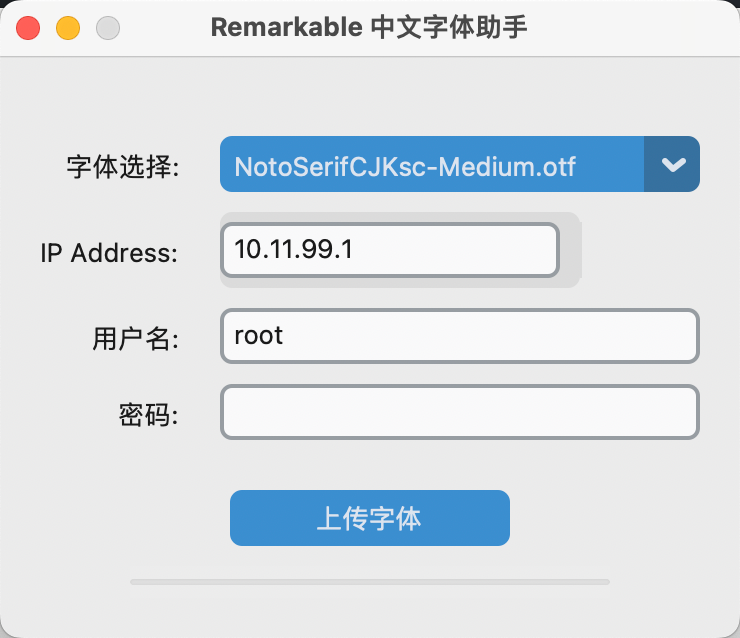
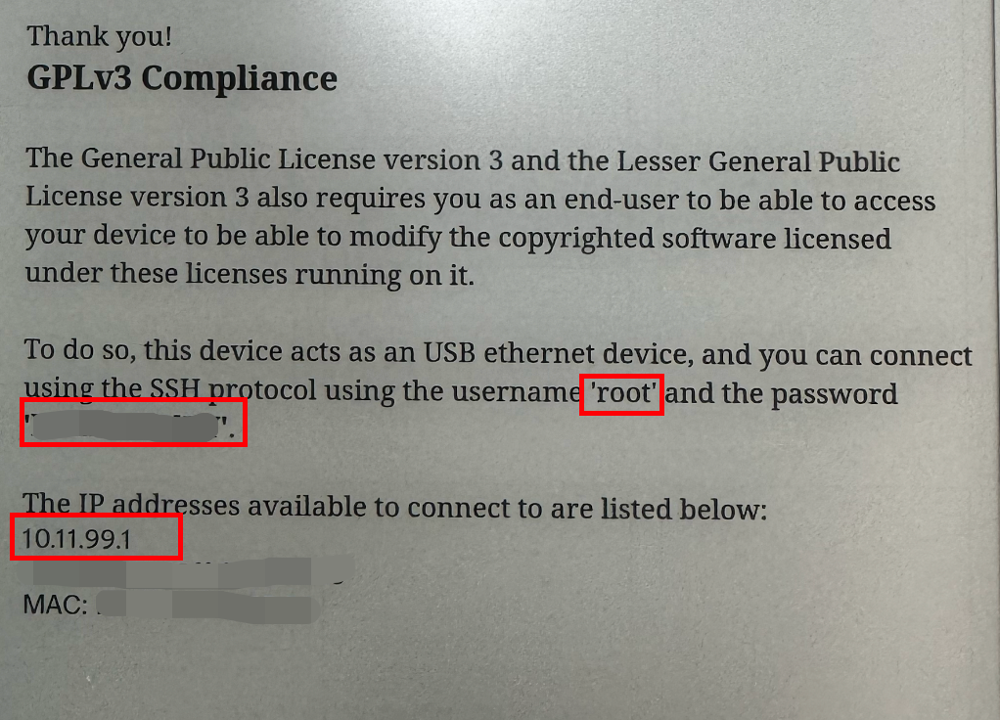

## Remarkable中文字体助手

该软件通过Python3.10.10+CTK+Paramiko+Pyinstaller+ChatGPT实现。

### 功能

通过GUI程序输入Remarkable的IP，用户名和密码，点击上传字体可以自动上传中文字体到Remarkable中，然后重启即可正常显示中文，解决每次升级Remarkable后都需要重新下载中文字体的问题。

#### 如何查看Remarkable的IP&用户名&密码

依次点击Menu - Settings - General - About - Copyrights and licenses

即可在页面右侧最下方看到

username（用户名）

password（密码）

IP address available（IP）

### 版本支持

> 由于本人目前只有mac m系列的电脑，目前只能编译M系列适用的app

- [ ] Win
- [ ] Linux
- [x] Mac M系列
- [ ] Mac Inter系列

